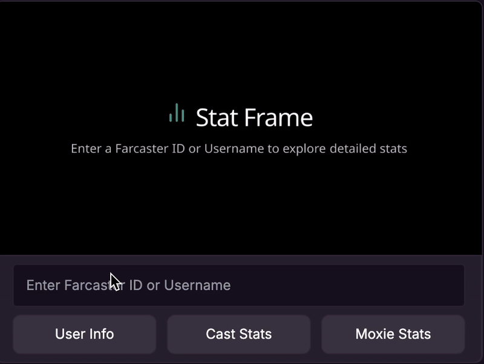

## Stat Frame

Stat Frame is a Farcaster Frame server that allows users to explore detailed statistics within Farcaster frames by entering a Farcaster id or username. It provides user information, cast stats (past 30 days), and Moxie earnings stats (lifetime).



### Features

- **User Info**: View profile information including display name, username, follower count, following count, and top channel contribution.
- **Cast Stats**: Analyze casts over the last 30 days, including total casts, reactions, recasts, replies, engagement rate, and total contribution.
- **Moxie Stats**: Check lifetime earnings stats for users, including total earned, cast earnings, frame developer earnings, and other earnings.

- Note: **Engagement Rate** is calculated as the total number of reactions, recasts, replies, and views divided by the number of followers times 100.

### Technologies Used

The project is built using the following technologies:

- [Next.js](https://nextjs.org/) for building the web app.
- [Frog Framework](https://frog.fm/) for building Farcaster frames and local frame validation.
- [Frog UI](https://frog.fm/ui/) for consistent and responsive UI components.
- [Neynar](https://neynar.com/) for Farcaster Hub.
- [Lum0x SDK](https://lum0x.com/) for getting user information (followes, following, casts, reactions, recasts, replies, moxie earnings).
- [Nanograph API](https://nanograph.xyz/) for getting top channel contribution and channel engagement metrics by user.
- [Vercel](https://vercel.com/) for hosting the application.

### Installation

1. **Install dependencies:**

   ```bash
   yarn install
   ```

2. **Create a `.env` file:**

   In the root directory, create a `.env` file with the following content:

   ```env
   LUM0X_API_KEY=your_lum0x_api_key
   NEYNAR_API_KEY=your_neynar_api_key
   ```

### Running the Application

To start the development server:

```bash
yarn run dev
```

### Devtools

To run the devtools:

```bash
yarn run copy:static
yarn run dev
```

Go to http://localhost:3000/api/dev to access the Frog devtools
